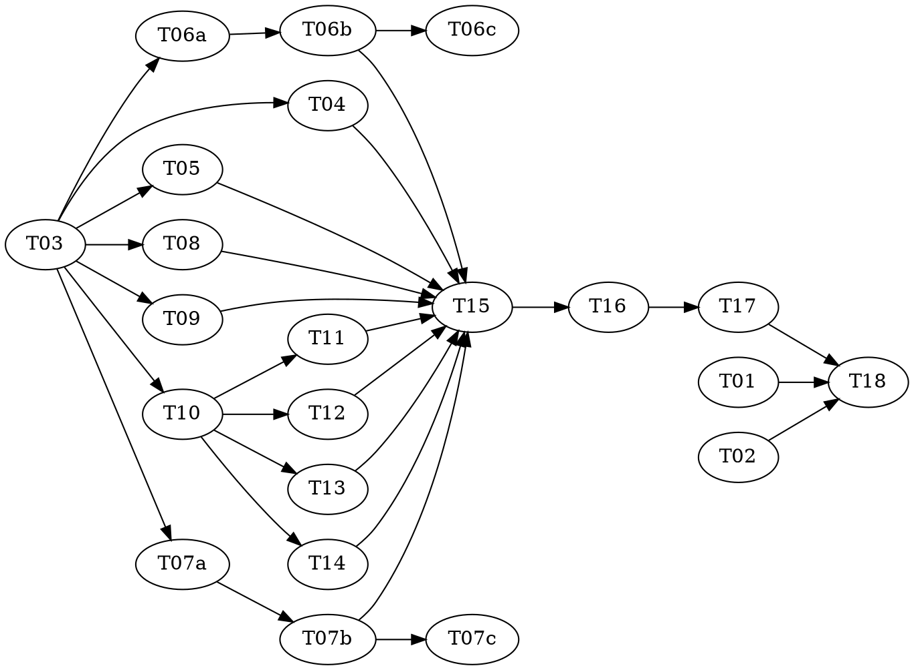

# vf-agentics Increment 1 — Core + Investigate — Implementation Plan

> **For agentic workers:** REQUIRED: Use superpowers:subagent-driven-development or superpowers:executing-plans to implement this plan. Steps use checkbox (`- [ ]`) syntax for tracking.

**Goal:** Ship the `vf-agentics` plugin skeleton, the IRON LAW, a mechanical lint that enforces it, four read-only agents, the shared `vfa-survey` nested workflow core, and the `investigate` skill — at parity with today's `investigate` plugin.

**Architecture:** A Claude Code plugin whose runtime artifacts are declarative (agent markdown, workflow JS, SKILL.md) and therefore not unit-testable in the classic sense. So the *test surface* is a lint engine: pure functions over source text, one rule per module, each with real unit tests. The lint rules then act as the failing tests for the declarative artifacts — write the rule (red: nothing satisfies it), then write the agent/workflow (green). `vfa-survey` is a nested workflow the other three skills will later call via `workflow('vfa-survey', …)`.

**Tech Stack:** Node 26.5.1, ESM (`.mjs`), built-in `node:test` runner, no dependencies, no `package.json` — matching the `reasonable` plugin's convention.

**Design doc:** `docs/superpowers/specs/2026-08-08-vf-agentics-design.md`

**Planned by:** claude-opus-5[1m]

---

## Scope note

Increment 1 ships **four agents**, not the full nine from the design. `planner`, `coder`, `verifier`, `reviewer` land in increment 2 and `diagnostician` in increment 3, when there is a workflow that uses them. YAGNI.

---

## Dependency Graph

| Task | Role | Depends On | Files Created/Modified |
|------|------|-----------|------------------------|
| T01 | — | — | `.claude-plugin/plugin.json`, `../.claude-plugin/marketplace.json` |
| T02 | — | — | `CLAUDE.md` |
| T03 | — | — | `tools/lint.mjs`, `test/lint.test.mjs` |
| T04 | — | T03 | `tools/rules/no-schema-bounds.mjs`, `test/no-schema-bounds.test.mjs` |
| T05 | — | T03 | `tools/rules/no-turn-caps.mjs`, `test/no-turn-caps.test.mjs` |
| T06a | red | T03 | `test/coverage-block.test.mjs` (authored here) |
| T06b | green | T06a | `tools/rules/coverage-block.mjs` (impl; test file READ-ONLY) |
| T06c | audit | T06b | — (audit only) |
| T07a | red | T03 | `test/workflow-meta.test.mjs` (authored here) |
| T07b | green | T07a | `tools/rules/workflow-meta.mjs` (impl; test file READ-ONLY) |
| T07c | audit | T07b | — (audit only) |
| T08 | — | T03 | `tools/rules/no-imports.mjs`, `test/no-imports.test.mjs` |
| T09 | — | T03 | `tools/rules/qualified-agent-types.mjs`, `test/qualified-agent-types.test.mjs` |
| T10 | — | T03 | `tools/rules/agent-frontmatter.mjs`, `test/agent-frontmatter.test.mjs` |
| T11 | — | T10 | `agents/scout.md` |
| T12 | — | T10 | `agents/historian.md` |
| T13 | — | T10 | `agents/doc-researcher.md` |
| T14 | — | T10 | `agents/analyst.md` |
| T15 | — | T04, T05, T06b, T07b, T08, T09, T11, T12, T13, T14 | `workflows/vfa-survey.workflow.js` |
| T16 | — | T15 | `workflows/vfa-investigate.workflow.js` |
| T17 | — | T16 | `skills/investigate/SKILL.md` |
| T18 | — | T01, T02, T17 | — (verification only) |

**Wave Schedule:**
- **Wave 1:** T01, T02, T03 — no dependencies
- **Wave 2:** T04, T05, T06a, T07a, T08, T09, T10 — seven rules in parallel
- **Wave 3:** T06b, T07b, T11, T12, T13, T14
- **Wave 4:** T06c, T07c, T15
- **Wave 5:** T16
- **Wave 6:** T17
- **Wave 7:** T18

## Adversarial-TDD note

Two behaviours use the red/green/audit triad: **T06 (coverage-block rule)** and **T07 (workflow-meta rule)**. Both involve real parsing judgment — locating a `return` object literal, and matching `phase()` calls against a `meta.phases` literal — where an implementer writing both sides would pin the tests to their own parsing approach.

The other five rules are regex-shaped with exact cases supplied in their task files, so per superpowers:adversarial-tdd they stay single tasks.

**This requires a subagent-capable executor.** Run with subagent-driven-development or executing-plans dispatching a fresh subagent per role task. Executed inline by one agent, the triad separation cannot be honoured — do not claim the guarantee in that case.

## Task Index

| ID | Name | File | Description |
|----|------|------|-------------|
| T01 | Plugin skeleton | `tasks/T01-plugin-skeleton.md` | `plugin.json` + marketplace entry |
| T02 | IRON LAW | `tasks/T02-iron-law.md` | `CLAUDE.md` carrying §0 verbatim |
| T03 | Lint orchestrator | `tasks/T03-lint-orchestrator.md` | Rule interface, file walk, finding format |
| T04 | Rule: no schema bounds | `tasks/T04-rule-no-schema-bounds.md` | Ban `minItems`/`maxItems`/`minLength`/`maxLength` |
| T05 | Rule: no turn caps | `tasks/T05-rule-no-turn-caps.md` | IRON LAW §1 — no counter-based termination |
| T06a | Coverage-block tests | `tasks/T06a-coverage-block-tests.md` | Failing tests for the coverage rule |
| T06b | Coverage-block rule | `tasks/T06b-coverage-block-rule.md` | IRON LAW §4 — every workflow returns `coverage` |
| T06c | Coverage-block audit | `tasks/T06c-coverage-block-audit.md` | Adversarial audit of T06a+T06b |
| T07a | Workflow-meta tests | `tasks/T07a-workflow-meta-tests.md` | Failing tests for the meta rule |
| T07b | Workflow-meta rule | `tasks/T07b-workflow-meta-rule.md` | `vfa-` prefix + phase titles match |
| T07c | Workflow-meta audit | `tasks/T07c-workflow-meta-audit.md` | Adversarial audit of T07a+T07b |
| T08 | Rule: no imports | `tasks/T08-rule-no-imports.md` | Workflow scripts cannot import |
| T09 | Rule: qualified agentTypes | `tasks/T09-rule-qualified-agent-types.md` | `agentType` must be `plugin:agent` |
| T10 | Rule: agent frontmatter | `tasks/T10-rule-agent-frontmatter.md` | Required frontmatter keys on `agents/*.md` |
| T11 | Agent: scout | `tasks/T11-agent-scout.md` | Read-only code search, sonnet/low |
| T12 | Agent: historian | `tasks/T12-agent-historian.md` | Git history, sonnet/low |
| T13 | Agent: doc-researcher | `tasks/T13-agent-doc-researcher.md` | External docs, sonnet/low |
| T14 | Agent: analyst | `tasks/T14-agent-analyst.md` | Judgment, opus/high, cannot search |
| T15 | vfa-survey | `tasks/T15-vfa-survey.md` | The shared nested core + resume loop + coverage |
| T16 | vfa-investigate | `tasks/T16-vfa-investigate.md` | Synthesis tail: report or tasks |
| T17 | investigate skill | `tasks/T17-investigate-skill.md` | SKILL.md, arg parsing, coverage surfacing |
| T18 | Verify + parity | `tasks/T18-verify-and-parity.md` | Full lint, full tests, parity vs old plugin |

## Execution Handoff

**Plan complete and saved to `docs/superpowers/plans/2026-08-08-increment-1-core-and-investigate/plan.md`.**

**1. Subagent-Driven (this session)** — dispatch fresh subagent per task, review between tasks

**2. Parallel Session (separate)** — open new session with executing-plans, batch execution
