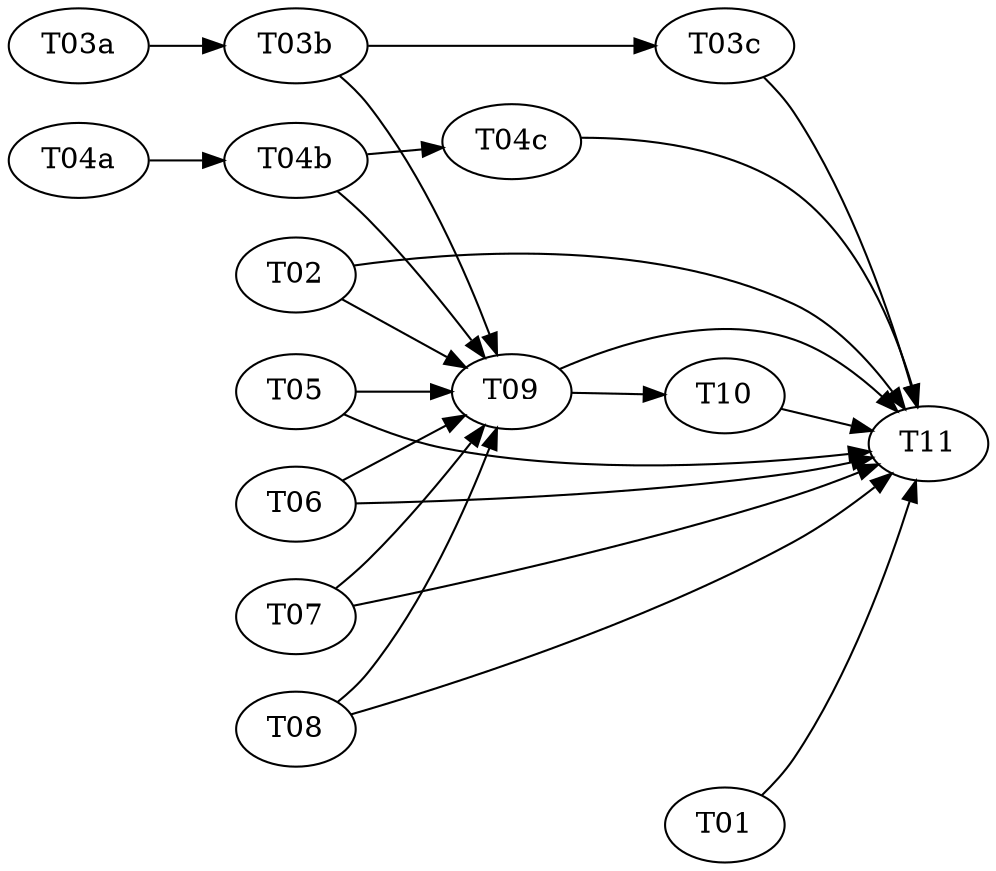

# vf-agentics Increment 2 — `develop` with Commit Discipline and the Adversarial Review Loop — Implementation Plan

> **For agentic workers:** REQUIRED: Use superpowers:subagent-driven-development or superpowers:executing-plans to implement this plan. Steps use checkbox (`- [ ]`) syntax for tracking.

**Goal:** Ship `vfa-develop` and the `develop` skill: work orders implemented as focused
single-concern commit series in isolated worktrees, mechanically verified (discriminator +
build + suite + commit-series checks), then driven through a per-order adversarial review
loop that exits only on a JS-computed zero-critical verdict — with the session owning
coupled orders, merges, the deferred frontier, and the human gate.

**Architecture:** Same split as increment 1 — declarative runtime artifacts (agents,
workflow, skill) enforced by the lint engine; deterministic logic in pure, unit-tested
`lib/` modules (`independence.mjs`, `commit-series.mjs`) reachable via CLI. Two ratified
post-design requirements govern everything: the commit series is the review artifact, and
review verdicts are computed, never claimed (a new lint rule, `no-self-verdict`, enforces
the latter). The workflow implements wave 1 only and never merges; the skill drives the
frontier. See `shared/architecture.md` and `shared/interfaces.md` (authoritative contracts).

**Tech Stack:** Node 26, ESM (`.mjs`), built-in `node:test`, no dependencies, no
`package.json` — increment-1 conventions carried unchanged.

**Design doc:** `docs/superpowers/specs/2026-08-08-vf-agentics-design.md` — amended by T01
in this plan to fold in the review loop and commit discipline.

**Planned by:** claude-fable-5[1m]

**Assumes:** Increment 1 (`2026-08-08-increment-1-core-and-investigate`) is complete and
merged: the lint engine and its seven rules, the four read-only agents, `vfa-survey`, and
the `investigate` skill all exist and pass `node tools/lint.mjs && node --test`.

---

## Scope note

This increment ships five new files of runtime surface (four agents + one workflow + one
skill), two `lib/` modules, one lint rule, and the spec amendment. `diagnostician`
(increment 3) and all UE implementation (increment 4) stay out — but T01's spec amendment
now also records §5c, the UE content-work verification doctrine (verification modes per
acceptance criterion, extraction deltas as the review artifact, work-order verification
cadence), so increment 4 inherits ratified decisions instead of re-deriving them. The superpowers-plan-as-work-order
source is deliberately NOT in scope — but the `preplanned` argument on `vfa-develop`
(needed for the deferred frontier) is the seam a future increment will use for it.

## Dependency Graph

| Task | Role | Depends On | Files Created/Modified |
|------|------|-----------|------------------------|
| T01 | — | — | `docs/superpowers/specs/2026-08-08-vf-agentics-design.md` |
| T02 | — | — | `tools/rules/no-self-verdict.mjs`, `test/no-self-verdict.test.mjs` |
| T03a | red | — | `test/independence.test.mjs` (authored here) |
| T03b | green | T03a | `lib/independence.mjs` (impl; test file READ-ONLY) |
| T03c | audit | T03b | — (audit only) |
| T04a | red | — | `test/commit-series.test.mjs` (authored here) |
| T04b | green | T04a | `lib/commit-series.mjs` (impl; test file READ-ONLY) |
| T04c | audit | T04b | — (audit only) |
| T05 | — | — | `agents/planner.md` |
| T06 | — | — | `agents/coder.md` |
| T07 | — | — | `agents/verifier.md` |
| T08 | — | — | `agents/reviewer.md` |
| T09 | — | T02, T03b, T04b, T05, T06, T07, T08 | `workflows/vfa-develop.workflow.js` |
| T10 | — | T09 | `skills/develop/SKILL.md` |
| T11 | — | T01, T02, T03c, T04c, T05–T08, T09, T10 | — (verification only) |

**Wave Schedule:**
- **Wave 1:** T01, T02, T03a, T04a, T05, T06, T07, T08 — eight independent tasks
- **Wave 2:** T03b, T04b — greens against locked tests
- **Wave 3:** T03c, T04c, T09 — audits + the workflow
- **Wave 4:** T10
- **Wave 5:** T11

## Adversarial-TDD note

Two behaviours use the red/green/audit triad: **T03 (`independence.mjs`)** and **T04
(`commit-series.mjs`)**. Both involve real contract-translation judgment — graph
partitioning semantics, and parsing a delimited git-log format — where an implementer
writing both sides would pin the tests to its own approach. T02's rule is regex-shaped
with exact cases supplied in the task file, so per superpowers:adversarial-tdd it stays a
single task.

**This requires a subagent-capable executor.** Dispatch each role task to a fresh subagent
with artifact-only handoff (spec + committed tests; never the red author's reasoning), and
run the separation gate before merging each green. Executed inline by one agent, the triad
separation cannot be honoured — do not claim the guarantee in that case.

There is a pleasing symmetry worth noticing while executing: the review loop this plan
BUILDS (fresh adversarial reviewer, computed verdicts, escalate on non-convergence) is the
same shape as the process EXECUTING the plan (fresh subagents, separation gates, two-stage
review). The plan practices what it ships.

## Task Index

| ID | Name | File | Description |
|----|------|------|-------------|
| T01 | Spec amendment | `tasks/T01-spec-amendment.md` | Fold review loop, commit discipline, and the UE verification doctrine (§5c) into the design doc |
| T02 | Rule: no-self-verdict | `tasks/T02-rule-no-self-verdict.md` | Ban verdict booleans in workflow schemas (IRON LAW §2) |
| T03a | Independence tests | `tasks/T03a-independence-tests.md` | Pin the partition contract (red) |
| T03b | Independence impl | `tasks/T03b-independence-impl.md` | Pure partition + CLI (green) |
| T03c | Independence audit | `tasks/T03c-independence-audit.md` | Adversarial audit of T03a+T03b |
| T04a | Commit-series tests | `tasks/T04a-commit-series-tests.md` | Pin parseLog + analyzeSeries (red) |
| T04b | Commit-series impl | `tasks/T04b-commit-series-impl.md` | Pure analyzer + CLI (green) |
| T04c | Commit-series audit | `tasks/T04c-commit-series-audit.md` | Adversarial audit of T04a+T04b |
| T05 | Agent: planner | `tasks/T05-agent-planner.md` | Work orders, honest loci, verbatim partition |
| T06 | Agent: coder | `tasks/T06-agent-coder.md` | Focused commit series + self-review, opus-free |
| T07 | Agent: verifier | `tasks/T07-agent-verifier.md` | Facts not verdicts; discriminator; merge mode |
| T08 | Agent: reviewer | `tasks/T08-agent-reviewer.md` | Findings on the severity ladder; no approval affordance |
| T09 | vfa-develop | `tasks/T09-vfa-develop.md` | The pipeline + the review loop, verdicts in JS |
| T10 | develop skill | `tasks/T10-develop-skill.md` | Coupled orders, merges, frontier, gate, KB |
| T11 | Verify | `tasks/T11-verify.md` | Gates, consistency sweep, live drills incl. IRON-LAW bite |

## Execution Handoff

**Plan complete and saved to
`docs/superpowers/plans/2026-08-08-increment-2-develop-review-loop/plan.md`.**

Per the owner's instruction this plan runs in a NEW session once the increment-1 session
has finished and merged. Preferred executor: superpowers:subagent-driven-development
(required for the triads; wave 1 parallelizes eight ways). Before starting, verify the
increment-1 acceptance bar: `node tools/lint.mjs && node --test` both clean at the repo
root.
